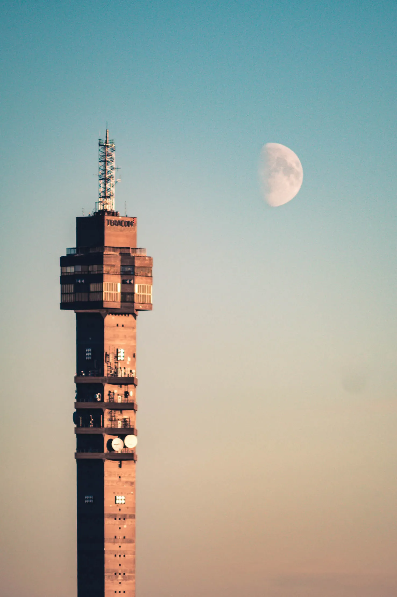

<!-- markdownlint-disable MD026 MD022 -->
<!-- markdownlint-disable MD026 MD041 MD033 -->

::page-title
---
title: That's no moon!
description: A story about a great photograph I took.
publishedAt: 19th of May, 2019
tags: photography
---
::
{.rounded}

## Did you get the joke? ##

Okay, yeah, I like Star Wars, and kudos to you for getting the joke. But seriously, that thing in the sky looks way too big to be the moon. It has to be the death star? 🤔

## How I took the shot ##

Setting the scene for this one. One evening working late at the office, I was sitting in the lounge on the top floor. The building is very open, and you could see through that entire floor window-to-window if you were standing outside looking through the building. Between the supporting pillars running from the floor to the ceiling, I could see something peeking out behind Kaknästornet, the moon! And it was huge! I quickly ran to my desk and grabbed my camera and my hefty zoom lens, which I just happened to have brought to the office that day.

I took this photo zoomed in all the way to 315mm and cropped it even further to get this shot.
